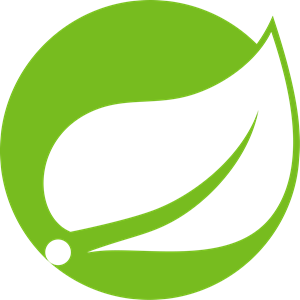
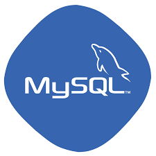

#### Java Backend Web Developer / 삼성 청년 SW 아카데미(SSAFY) 9기 교육생
## 최 효 빈
                           

<!--모델 : https://roseline.oopy.io/resume-->

[ Discord "데일리 CS 퀴즈 채널" 운영 중 ]

### 📞 CONTACT
**Naver.** gyqls234@naver.com      
**Gmail.** gyqls234@gmail.com   

&nbsp;

### 🛠️ Stack.  

   **Java** &nbsp;  
- Java 인터페이스, Singleton 패턴, 또는 Builder 패턴을 이용한 MVC 패턴 구현 가능 &nbsp;  
- 백준 Online Judge Gold 3 티어 &nbsp;  
- Mockito, RestDocs를 이용하여 단위 테스트 코드 작성 및  API 문서 작성
&nbsp;  

 **Spring**
- Spring MVC와  RESTful API를 이용한 SPA 개발 경험 : SSAFY 전공자 분반 최우수 PJT상 수상
- IoC와 DI 등 Spring의 의존성 관리 메커니즘의 학습과 이해
  &nbsp;
   
 **MySQL**
- 요구사항에 필요한 Join과 SubQuery, 가상 테이블(View) 활용 가능 
- JPA 또는 MyBatis를 이용한 Spring Project와의 DB연동 
- SQLD 자격증 보유, 웹 프로젝트 DB설계 경험 다수
  &nbsp;  

<!--

  
  -->
<!--
(Java를 메인으로 하고, 공고를 보고 필요한 스택만 표시해서 제출.)

 
 
 

 
 
   
  
   
  
  
  
  
  

-->
&nbsp;
---
&nbsp;

## 💻 Project

### 🍏Ringo : 여행지 정보 웹사이트

여행지 검색, 여행 계획을 작성하고 관광지 포토리뷰, 여행정보 게시판 등 커뮤니티를 제공하는 
Spring Framework 기반의 REST API + Vue.js 기반의 클라이언트로 구성된 Single Page Application입니다.
'23.05.01 - '23.05.26 (3주) , 개발인원 2명

**[기획의도]**
- 코로나 19 이후 증가한 온라인 여행 플래너 수요에 부합하는 서비스를 만들고자 하였습니다.
- Axios 비동기 통신을 이용하여, 사용자가 실시간으로 데이터와 상호작용할 수 있는 웹 서비스를 구현하고자 하였습니다.
- ChatGPT, Kakao API, 공공데이터 등등 웹서비스의 유용성을 높이는 API들을 활용하였습니다.
 
**[역할]** : 팀장
- DB구조 설계, 협업체계(Git) 관리
- 회원기능, 관광지 정보, 포토리뷰, 여행계획 구현

**🎥시연 영상:**  
https://www.youtube.com/watch?v=Zujd17yREBY

### 🍒Cherrypick : 로컬 카페 추천 웹사이트

이용자들이 핫플레이스 카페들을 리스트로 모아 공유하고, 카페 방문 후기를 남기는 웹 서비스입니다.
'22.07.01 - '22.07.26 (3주) , 개발인원 3명

**[기획의도]** 
- 식당 정보를 공유하는 <망고플레이트>를 벤치마킹하여, 카페를 타겟팅한 웹서비스를 제작하고자 하였습니다.
- Spring 프레임워크 기반의 MVC 모델을 적용하였습니다.
 
**[역할]** : 팀원
- 파일업로드 구축, 카페(사업장) 리스트업 기능 구현,
- Ajax 비동기 통신을 이용한 회원 및 카페(사업장) CRUD를 구현
- 전체적인 프론트엔드 작업 담당

**GitHub:**  
https://github.com/HyebinPark96/CherryPick  

  
&nbsp;  
---
&nbsp;      

&nbsp;

**GitHub:**   
https://github.com/AtomicLiquors/jsp-music-website/

&nbsp;  
---
&nbsp;    

&nbsp;  
---

&nbsp;  

### 📙 Education
- 부산대학교 인문대학 중어중문학과 학사졸업(최우등)  / `14.03.03 – '20.08.28
- 대만 국립정치대학 교환학생 파견  / `19.02.25 – '19.06.30
- 부산IT교육센터 [NCS] (디지털컨버전스)자바 기반 클라우드 융합 응용SW개발 과정 수료  / '22.01.17 - '22.07.26

&nbsp;  

### 💳 Certification
- TOEIC 935 ('22.05.29)
- 컴퓨터활용능력(1급) 취득 ('20.11.23)
- 정보처리기사 자격증 취득 ('22.06.17)
- SQLD 자격증 취득 (`23.04.14)

&nbsp;  
---

&nbsp;  

### 💳 Trivia
##### 독서 목록
- 누구나 자료구조와 알고리즘 개정2판
- 자바의 정석 3판 1권
- 프로그래머의 길, 멘토에게 묻다
- 객체지향의 사실과 오해

&nbsp;  
- 네이비 씰 승리의 기술 [조코 윌링크]
- Think Hard! 몰입 [황농문]

&nbsp;  
---

### 📺 See Also

**Blog.** [https://atomicliquors.tistory.com/](https://atomicliquors.tistory.com/)

**Github.**  [https://github.com/AtomicLiquors](https://github.com/AtomicLiquors)

<!--우부콘 2022 갔다온 얘기.-->
<!--========================================-->

<!-- Project REadme로.
**역할 분담**  
김서하  
● DB 설계 및 클라우드 DB 관리  
● Kakaomap api로 지도 데이터 적용  
● Ajax 비동기 통신 활용한 카페 , 북마크 crud   

박혜빈  
● 개발환경 구축 및 형상관리  
● Spring Security 적용 권한 및 인증 설정 / Bcrypt 로 패스워드 해싱  
● HttpSession로 유저 정보 관리  
● SmartEditor 리뷰 작성 및 게시판 구현  
● jQuery / Ajax / Jackson 라이브러리 사용으로 JSON 데이터 변환 및 비동기 통신  
● RESTful API 설계  
● ErrorController 인터페이스 구현으로 에러페이지 커스터마이징  
● MyBatis 동적 쿼리 사용으로 분기처리  
  
최효빈  
● 프론트엔드 : css 디자인 및 js/jquery 이용 동적 엘리먼트 제어  
● 파일업로드 구현 및 Drag & Drop 방식과 이미지 미리보기 구현  
● Ajax 비동기 통신을 통한 카페(사업장) 등록 및 수정 구현  -->
